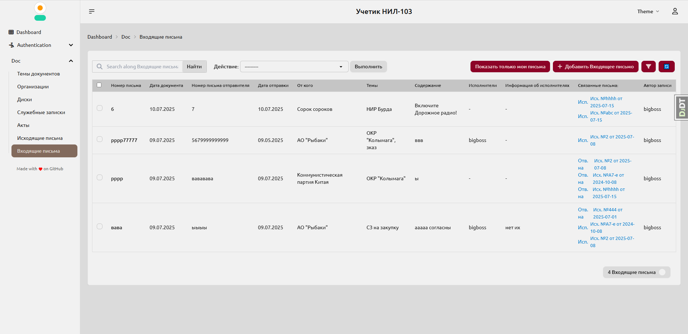

# 📁 Django Документооборот — Учет документации

Добро пожаловать в систему учета документации для организации!  
Эта панель администратора на Django позволяет эффективно управлять служебными записками, актами, входящими и исходящими письмами с удобным поиском и фильтрацией.

---

## 🚀 Основные возможности

- 📄 Ведение документов разных типов: **Memo**, **Act**, **IncomingLetter**, **OutgoingLetter**  
- 📂 Прикрепление файлов к любому документу с возможностью скачивания  
- 🔎 Удобный поиск и фильтрация по дате, теме, автору и другим параметрам  
- 🔗 Связь входящих и исходящих писем для контроля переписки  
- 👥 Управление организациями, исполнителями и темами документов

---

## 🌐 Взаимодействие с приложением

Основной интерфейс управления и взаимодействия происходит через админ-панель Django, доступную по адресу:  
http://localhost:8000/admin
Здесь вы можете создавать, редактировать и просматривать все данные, связанные с документацией, организациями и прикрепленными файлами.

---

## 🖼 Скриншоты приложения

Ниже вы можете добавить скриншоты интерфейса для наглядности:


  
*Форма создания служебной записки с выбором тем и прикреплением файлов*

---

## 🛠 Установка и запуск

```bash
# Клонируйте репозиторий
git clone https://github.com/username/repo.git
cd repo

# Установите зависимости
pip install -r requirements.txt

# Примените миграции
python manage.py migrate

# Запустите сервер
python manage.py runserver
